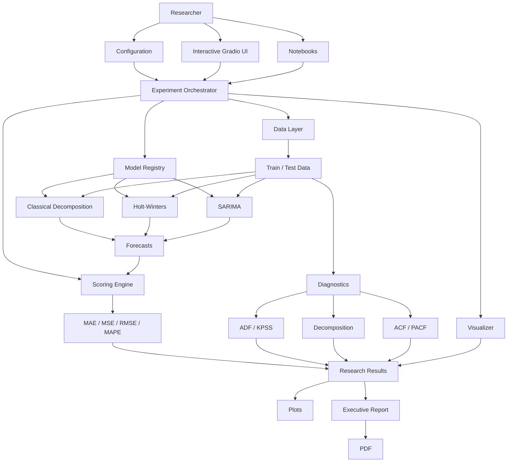

# 🔬 Time Series Research Lab

> **An experiment-first research environment for time series forecasting — investigate models, diagnostics, and hypotheses without drowning in implementation overhead.**

[](https://www.python.org/)
[](https://www.gradio.app/)
[](https://pandas.pydata.org/)
[](https://www.statsmodels.org/)
[](LICENSE)

---

## 🧪 What Is This?

**Time Series Research Lab is a research-oriented experimentation environment for classical time series forecasting.**

The goal is simple:

> **Let researchers spend their time investigating experiments instead of repeatedly writing infrastructure code.**

When conducting forecasting research, a large amount of effort can disappear into tasks that are not actually the research question:

- loading and validating datasets
- creating train/test splits
- configuring models
- implementing forecasting loops
- calculating evaluation metrics
- generating diagnostic plots
- comparing models
- producing experiment reports
- maintaining visualization code
- handling logging and configuration

This project centralizes those responsibilities into a reusable experimentation workflow.

Instead of repeatedly implementing the same pipeline, a researcher can focus on questions such as:

> *Is this series stationary?*

> *Does the observed seasonality justify a seasonal model?*

> *How does Holt-Winters compare with SARIMA on this dataset?*

> *Which model performs best on the out-of-sample horizon?*

> *What do the ACF/PACF and decomposition diagnostics tell us about the underlying temporal structure?*

The system is therefore designed as a **research laboratory**, not simply as a forecasting application.

---

## 🎯 Research Philosophy

```text
                 ┌─────────────────────────────┐
                 │      Research Question      │
                 └──────────────┬──────────────┘
                                │
                                ▼
                 ┌─────────────────────────────┐
                 │      Dataset / Hypothesis   │
                 └──────────────┬──────────────┘
                                │
                                ▼
                 ┌─────────────────────────────┐
                 │       Diagnostics            │
                 │  • Stationarity             │
                 │  • Seasonality              │
                 │  • ACF / PACF               │
                 │  • Decomposition            │
                 └──────────────┬──────────────┘
                                │
                                ▼
                 ┌─────────────────────────────┐
                 │      Model Experiments      │
                 │  • Decomposition            │
                 │  • Holt-Winters             │
                 │  • SARIMA                   │
                 └──────────────┬──────────────┘
                                │
                                ▼
                 ┌─────────────────────────────┐
                 │       Evaluation            │
                 │  • MAE                      │
                 │  • MSE                      │
                 │  • RMSE                     │
                 │  • MAPE                     │
                 └──────────────┬──────────────┘
                                │
                                ▼
                 ┌─────────────────────────────┐
                 │     Visual Interpretation   │
                 └──────────────┬──────────────┘
                                │
                                ▼
                 ┌─────────────────────────────┐
                 │      Research Conclusion    │
                 └─────────────────────────────┘
```

The architecture reflects this workflow directly: the experiment orchestrator coordinates ingestion, model construction, scoring, forecasting, and visualization.

---

# ✨ Why This Project Exists

Traditional experimentation often looks like this:

```text
Research Question
      │
      ▼
Write preprocessing code
      │
      ▼
Write model code
      │
      ▼
Write evaluation code
      │
      ▼
Write plotting code
      │
      ▼
Fix data/index issues
      │
      ▼
Repeat everything for another model
      │
      ▼
Finally investigate the hypothesis
```

This project aims to move the researcher toward:

```text
Research Question
      │
      ▼
Configure Experiment
      │
      ▼
Run
      │
      ├── Diagnostics
      ├── Forecasting
      ├── Metrics
      ├── Visualizations
      └── Report
      │
      ▼
Investigate Results
```

### 🧠 The central idea

**The code is the laboratory infrastructure.**

**The experiment is the research.**

---

# 🚀 What Can It Do?

## 📊 Data Ingestion

The data layer supports:

- CSV
- Excel (`.xlsx`, `.xls`)
- Parquet

It can optionally convert a configured column into a datetime index, sort the resulting time series, and create train/test partitions. 
---

## 🔬 Statistical Diagnostics

The diagnostic engine currently supports:

- **ADF — Augmented Dickey-Fuller**
- **KPSS — Kwiatkowski-Phillips-Schmidt-Shin**
- Seasonal decomposition
- Model fitting diagnostics
- Stationarity reporting

ADF and KPSS are evaluated jointly to distinguish outcomes such as:

- Strictly stationary
- Difference stationary
- Trend stationary
- Non-stationary
- Insufficient data / error


---

## 📈 Forecasting Experiments

The current model registry contains three forecasting strategies:

| Model | Research Role |
|---|---|
| 🧩 Classical Decomposition | Investigate trend + seasonal structure |
| 📉 Holt-Winters | Investigate level, trend, and seasonal smoothing |
| 📐 SARIMA | Investigate autoregressive, differencing, moving-average, and seasonal dynamics |

The registry maps experiment names to concrete model implementations, making the execution pipeline independent from individual model implementations.

### Classical Decomposition

The decomposition model extracts seasonal structure and estimates a trend component before extending the resulting structure into the forecast horizon.

### Holt-Winters

The exponential smoothing implementation supports configurable trend, seasonal behavior, and seasonal periods.

### SARIMA

The SARIMA implementation wraps Statsmodels' SARIMAX engine and exposes configurable non-seasonal and seasonal orders.

---

# 📏 Experiment Evaluation

The evaluation layer provides:

- **MAE**
- **MSE**
- **RMSE**
- **MAPE**

The scoring engine also validates that actual and predicted series have compatible lengths and matching temporal indexes before evaluation. 
This is important for research because a metric should not silently compare misaligned temporal observations.

---

# 📊 Visualization & Diagnostics

The visualization layer is responsible for generating research-oriented plots rather than only producing final forecast charts.

The repository currently contains examples including:

- Time-series line plots
- Seasonal plots
- Decomposition plots
- Envelope analysis
- Forecast vs. actual plots
- SARIMA fitting diagnostics
- ACF/PACF diagnostics
- Holt-Winters exploration

The `Visualizer` is designed around time-series-aware plotting, including frequency-aware temporal axes and diagnostic visualization.

For example, ACF and PACF are generated together to investigate temporal correlation structure.

---

# 🖥️ Interactive Research Interface

The project includes a **Gradio-based interactive research workspace**.

The interface is divided conceptually into two research modes:

### ⚡ Batch Experimentation

Run the registered forecasting models against a dataset and compare their out-of-sample performance.

### 🧪 Interactive Experiment Sandbox

Experiment with individual model configurations and inspect their resulting diagnostics.

The Gradio application wires dedicated experiment controls for:

- Classical decomposition
- Holt-Winters
- SARIMA


The application launches on port `7860` when `gradio_app.py` is executed directly.

---

# 📄 Research Reports

Experiment results can be transformed into an executive-style Markdown report and exported to PDF.

The generated report can include:

- Dataset information
- Target and index configuration
- Validation split
- Model hyperparameters
- Comparative metrics
- Forecast visualizations
- Stationarity diagnostics
- ACF/PACF analysis
- Conclusions and recommendations


This makes the experiment easier to communicate beyond the Python environment.

---

# 🏗️ Architecture



The core orchestrator explicitly coordinates data ingestion, model execution, scoring, and visualization.

---

# 🧩 Project Structure

```text
..
├── configs/
│   ├── config.yaml               # Model, data, scoring, and visualization configurations
│   └── logging.yaml              # Logging infrastructure configuration manifest
├── data/                         # File directory for raw time series datasets
├── logs/                         # File logging output directory
├── notebooks/                    # Exploratory data analysis & development notebooks
│   ├── data_preprocessing.ipynb
│   └── dev.ipynb
├── plots/                        # Rendered visual asset cache directory
├── reports/                      # Generated executive performance PDF reports
├── src/                          # Core source codebase
│   ├── config.py                 # Dataclass schemas and YAML configuration loader
│   ├── data.py                   # Ingestion, validation, and train/test partition loader
│   ├── diagnostics.py            # ADF/KPSS stationarity tests & fit calculations
│   ├── gradio_app.py             # Gradio web UI layout builder and event handlers
│   ├── logger.py                 # Logging initialization utility
│   ├── metrics.py                # Vectorized error evaluation math engine (MAE, MSE, RMSE, MAPE)
│   ├── models.py                 # Model wrappers (Decomposition, Holt-Winters, SARIMA)
│   ├── orchestrator.py           # Experiment orchestrator & pipeline execution engine
│   └── visualizer.py             # Matplotlib visualizer and time series plot engine
├── tests/                        # Automated unit tests directory
│   ├── test_data.py
│   └── test_visualization.py
├── main.py                       # CLI execution entry point
├── pyproject.toml                # Project dependency configuration
├── tasks.md                      # Development roadmap and tracking tasks
└── README.md
```

---

# 🔧 Configuration-Driven Experiments

Experiment configuration is centralized rather than hard-coded throughout the execution pipeline.

The configuration schema covers:

- Dataset path
- Train/test split
- Datetime index
- Visualization settings
- Decomposition settings
- Holt-Winters settings
- SARIMA parameters
- Evaluation metrics


For example, the model configuration schema exposes SARIMA parameters:

```yaml
models:
  sarima:
    p: 1
    d: 0
    q: 1
    P: 0
    D: 0
    Q: 0
    s: null
```

> **Note:** The exact contents of the repository's `configs/config.yaml` should be treated as the source of truth. The example above reflects the configuration schema implemented in `src/config.py`, not a claim about the current YAML file contents.

---

# 💻 Installation

## Prerequisites

Before starting, install:

| Requirement | Purpose |
|---|---|
| 🐍 Python 3.12+ | Runtime |
| 🔧 Git | Clone the repository |
| 📦 pip | Install Python dependencies |
| 🌐 Modern browser | Access the Gradio interface |

The supplied project sources are written against Python 3.12-era environments.

---

## 🪟 Windows

### 1. Install Git

Install Git for Windows from:

https://git-scm.com/download/win

Verify:

```powershell
git --version
```

### 2. Install Python

Install Python from:

https://www.python.org/downloads/

During installation, enable:

> **Add Python to PATH**

Verify:

```powershell
python --version
pip --version
```

### 3. Clone the repository

```powershell
git clone <REPOSITORY_URL>
cd <PROJECT_DIRECTORY>
```

Replace `<REPOSITORY_URL>` and `<PROJECT_DIRECTORY>` with the actual repository values.

### 4. Create a virtual environment

```powershell
python -m venv .venv
```

### 5. Activate it

```powershell
.\.venv\Scripts\Activate.ps1
```

If PowerShell blocks activation because of execution policy, use:

```powershell
Set-ExecutionPolicy -ExecutionPolicy RemoteSigned -Scope CurrentUser
```

Then activate again:

```powershell
.\.venv\Scripts\Activate.ps1
```

### 6. Install the project

Because the repository contains `pyproject.toml`, the preferred installation path is:

```powershell
python -m pip install --upgrade pip
python -m pip install -e .
```


---

## 🍎 macOS

### 1. Install Git

macOS may provide Git through Apple's developer tools.

Verify:

```bash
git --version
```

If Git is not installed:

```bash
xcode-select --install
```

### 2. Install Python

Install Python 3.12+ from:

https://www.python.org/downloads/macos/

Verify:

```bash
python3 --version
python3 -m pip --version
```

### 3. Clone the repository

```bash
git clone <REPOSITORY_URL>
cd <PROJECT_DIRECTORY>
```

### 4. Create a virtual environment

```bash
python3 -m venv .venv
```

### 5. Activate it

```bash
source .venv/bin/activate
```

### 6. Install the project

```bash
python -m pip install --upgrade pip
python -m pip install -e .
```

---

## 🐧 Linux

### 1. Install Git

For Debian/Ubuntu-based systems:

```bash
sudo apt update
sudo apt install git
```

Verify:

```bash
git --version
```

### 2. Install Python

Verify first:

```bash
python3 --version
```

If Python 3.12+ is already available, continue.

Otherwise install an appropriate Python version for your Linux distribution.

### 3. Clone the repository

```bash
git clone <REPOSITORY_URL>
cd <PROJECT_DIRECTORY>
```

### 4. Create a virtual environment

```bash
python3 -m venv .venv
```

If the `venv` module is missing on Debian/Ubuntu:

```bash
sudo apt install python3-venv
```

Then create the environment again:

```bash
python3 -m venv .venv
```

### 5. Activate it

```bash
source .venv/bin/activate
```

### 6. Install the project

```bash
python -m pip install --upgrade pip
python -m pip install -e .
```

---

# ▶️ Running the Research Interface

The verified Gradio application can be launched directly with:

```bash
python src/gradio_app.py
```

On Windows PowerShell:

```powershell
python src\gradio_app.py
```

The application is configured to launch on:

```text
http://localhost:7860
```

The application source explicitly launches Gradio on port `7860`.

Open the displayed local URL in your browser.

---

# 🧪 Running an Experiment

The research workflow is conceptually:

```text
1. Select / provide dataset
        ↓
2. Select target column
        ↓
3. Select temporal index
        ↓
4. Define validation split
        ↓
5. Investigate diagnostics
        ↓
6. Configure forecasting model
        ↓
7. Run experiment
        ↓
8. Inspect forecast
        ↓
9. Compare metrics
        ↓
10. Interpret the result
```

The interactive application supports dataset ingestion and exposes model-specific experiment controls for decomposition, Holt-Winters, and SARIMA. 
---

# 🔍 Understanding the Experiment Pipeline

For a single model experiment, the system performs:

```text
Dataset
   │
   ▼
Train/Test Split
   │
   ▼
Model Registry
   │
   ▼
Model Construction
   │
   ▼
Fit on Training Data
   │
   ▼
Forecast Test Horizon
   │
   ▼
Align Predictions + Actuals
   │
   ▼
Calculate Metrics
   │
   ▼
Generate Validation Visualization
   │
   ▼
Research Result
```

The orchestrator follows this sequence explicitly: it retrieves the train/test partitions, constructs the selected model, fits it, forecasts the test horizon, evaluates predictions, and generates a prediction-vs-actual visualization.

---

# 🧪 Running All Registered Models

The experiment orchestrator also provides a batch comparison workflow.

Conceptually:

```text
                 Dataset
                    │
       ┌────────────┼────────────┐
       ▼            ▼            ▼
 Decomposition  Holt-Winters   SARIMA
       │            │            │
       ▼            ▼            ▼
    Forecast     Forecast     Forecast
       │            │            │
       └────────────┼────────────┘
                    ▼
             Metric Evaluation
                    │
                    ▼
          Comparative Results
```

The batch runner isolates model failures so that an error in one experiment does not automatically terminate the entire comparison.

This is particularly useful for research because it makes **model comparison a first-class experiment rather than a collection of manually executed scripts**.

---

# 📐 Diagnostics as Research Evidence

The system intentionally separates **forecasting performance** from **statistical evidence**.

For example:

```text
                  Time Series
                       │
          ┌────────────┼────────────┐
          ▼            ▼            ▼
     Stationarity   Seasonality   Correlation
          │            │            │
       ADF/KPSS    Decomposition   ACF/PACF
          │            │            │
          └────────────┼────────────┘
                       ▼
               Model Selection
                       │
                       ▼
                  Forecasting
```

This allows researchers to investigate *why* a model might be appropriate instead of evaluating models solely by their final error scores.

---

# 📊 Evaluation Metrics

The project currently supports four configurable metrics:

| Metric | Meaning |
|---|---|
| **MAE** | Mean Absolute Error |
| **MSE** | Mean Squared Error |
| **RMSE** | Root Mean Squared Error |
| **MAPE** | Mean Absolute Percentage Error |

MAPE has explicit zero-value handling: by default, true zero targets raise a mathematical-domain error unless an `epsilon` correction is configured.

This behavior is intentional: silently producing misleading percentage errors can be worse than explicitly stopping the experiment.

---

# 📓 Notebooks

The repository also contains exploratory notebooks:

```text
notebooks/
├── data_preprocessing.ipynb
└── dev.ipynb
```

The notebooks complement the reusable pipeline:

> **Notebooks are for exploration and investigation; the `src/` modules provide reusable experiment infrastructure.**

This separation helps prevent the research workflow from becoming entirely dependent on one-off notebook cells.

---

# 🧱 Core Modules

| Module | Responsibility |
|---|---|
| `config.py` | Typed experiment configuration |
| `data.py` | Data ingestion and train/test splitting |
| `diagnostics.py` | Statistical diagnostics and model fitting helpers |
| `models.py` | Forecasting model implementations |
| `metrics.py` | Forecast evaluation |
| `orchestrator.py` | End-to-end experiment execution |
| `visualizer.py` | Research visualization |
| `gradio_app.py` | Interactive research interface |
| `logger.py` | Logging infrastructure |

The configuration module uses typed dataclasses to represent experiment settings. The data module encapsulates ingestion and splitting, while the logging layer loads its behavior from YAML configuration. 
---

# 🧪 Testing

Tests are located under:

```text
tests/
├── test_data.py
└── test_visualization.py
```

Run the test suite with:

```bash
python -m pytest
```

> The repository tree confirms the presence of these test modules. The exact currently passing test count is intentionally not documented here because no test execution result was supplied.

---

# 🛠️ Development Workflow

A typical research/development cycle looks like:

```text
┌───────────────────────┐
│ Define Research Idea  │
└───────────┬───────────┘
            ▼
┌───────────────────────┐
│ Prepare Configuration │
└───────────┬───────────┘
            ▼
┌───────────────────────┐
│ Run Diagnostics       │
└───────────┬───────────┘
            ▼
┌───────────────────────┐
│ Run Model Experiments │
└───────────┬───────────┘
            ▼
┌───────────────────────┐
│ Compare Metrics       │
└───────────┬───────────┘
            ▼
┌───────────────────────┐
│ Inspect Visuals       │
└───────────┬───────────┘
            ▼
┌───────────────────────┐
│ Interpret Results     │
└───────────┬───────────┘
            ▼
┌───────────────────────┐
│ Document Finding      │
└───────────────────────┘
```

---

# 🔌 Extending the Research Lab

The architecture is designed around a model abstraction and registry.

The forecasting layer defines a common `BaseModel` contract around:

```text
fit(...)
predict(...)
```

while concrete implementations provide individual forecasting strategies.

The orchestrator then resolves models through the registry:

```python
MODEL_REGISTRY = {
    "decompose": DecompositionModel,
    "exponential_smoothing": ExponentialSmoothingModel,
    "sarima": SARIMAModel,
}
```


This creates a natural extension point for future research models.

A new forecasting strategy can conceptually become:

```text
New Research Model
       │
       ▼
Implement BaseModel contract
       │
       ▼
Add configuration schema
       │
       ▼
Register model
       │
       ▼
Run through existing pipeline
       │
       ├── Evaluation
       ├── Visualization
       └── Comparison
```

The important architectural principle is that **research infrastructure should not need to be rewritten every time a new forecasting hypothesis is tested.**

---

# ⚙️ Configuration Architecture

The configuration system separates concerns:

```text
configs/
│
├── config.yaml
│      │
│      ├── Data
│      ├── Visualization
│      ├── Models
│      │     ├── Decomposition
│      │     ├── Holt-Winters
│      │     └── SARIMA
│      │
│      └── Scoring
│
└── logging.yaml
       │
       └── Logging infrastructure
```

The configuration loader converts YAML data into typed configuration objects using dataclasses and `dacite`. 
---

# 📝 Research Reports

The application can produce an executive report containing:

<details>
<summary>📄 Report contents</summary>

### Executive Summary

Identifies the best-performing model according to the available primary metric.

### Dataset Configuration

Records:

- Source dataset
- Target variable
- Temporal index
- Validation split

### Model Configuration

Records the parameters used by:

- Classical decomposition
- Holt-Winters
- SARIMA

### Experimental Results

Provides comparative evaluation metrics.

### Diagnostics

Includes:

- Stationarity analysis
- ADF results
- ACF/PACF analysis
- Model-specific observations

### Conclusions

Summarizes model trade-offs and the selected result.

</details>

The report generator is implemented directly in the Gradio application and can also export the Markdown report to PDF.

---

# ⚠️ Important Research Considerations

This project is intended to **assist research**, not replace statistical reasoning.

A lower forecasting error does not automatically prove that a model is theoretically superior.

Researchers should consider:

- temporal leakage
- appropriate validation horizons
- stationarity assumptions
- seasonal structure
- data quality
- metric suitability
- model assumptions
- residual behavior
- statistical significance
- domain-specific interpretation

The purpose of this laboratory is to reduce **implementation overhead**, not to automate scientific judgment.

---

# 🗺️ Current Scope

### Currently implemented

- [x] Configuration-driven experiments
- [x] CSV ingestion
- [x] Excel ingestion
- [x] Parquet ingestion
- [x] Train/test splitting
- [x] ADF diagnostics
- [x] KPSS diagnostics
- [x] Classical decomposition
- [x] Holt-Winters exponential smoothing
- [x] SARIMA
- [x] MAE
- [x] MSE
- [x] RMSE
- [x] MAPE
- [x] Time-series visualization
- [x] ACF/PACF visualization
- [x] Interactive Gradio workspace
- [x] Batch model comparison
- [x] Markdown experiment reporting
- [x] PDF report generation
- [x] Logging infrastructure
- [x] Automated tests

---

# 🤝 Contributing

Contributions are welcome, particularly contributions that improve the project's value as a **research experimentation platform**.

Potential contribution areas include:

- New forecasting models
- New statistical diagnostics
- Better experiment comparison
- Additional evaluation metrics
- New visualization techniques
- Dataset adapters
- Research-oriented reporting
- Test coverage
- Documentation

When adding a new model, prefer extending the existing model abstraction and registry rather than introducing an independent execution path.

---

# 📜 License

This project includes a `LICENSE` file in the repository.

Please consult [`LICENSE`](LICENSE) for the authoritative licensing terms.

---

# 🔭 Vision

The long-term vision is to evolve this project from a collection of forecasting utilities into a reusable **research laboratory for systematic time-series experimentation**.

The guiding principle remains:

> ### 🧠 Less implementation overhead. More scientific investigation.

A researcher should be able to spend less time rebuilding:

```text
data loading
     +
splitting
     +
model wrappers
     +
metrics
     +
plots
     +
reports
```

and more time asking:

```text
"What does the data tell us?"

"Why does this model behave this way?"

"Which assumptions are valid?"

"Which hypothesis survives experimentation?"
```

---

## ⭐ Project Philosophy

```text
                         RESEARCH
                            ▲
                            │
                            │
              ┌─────────────┴─────────────┐
              │                           │
        Statistical                  Experimental
        Investigation                Comparison
              │                           │
              └─────────────┬─────────────┘
                            │
                            ▼
                  ┌───────────────────┐
                  │  TIME SERIES LAB  │
                  └───────────────────┘
                            │
             ┌──────────────┼──────────────┐
             ▼              ▼              ▼
          Models       Diagnostics      Evaluation
             │              │              │
             └──────────────┼──────────────┘
                            ▼
                     Visual Evidence
                            │
                            ▼
                    Research Findings
```

**The objective is not to hide the mathematics.**

**The objective is to remove the repetitive engineering required to investigate it.**

---

<p align="center">
  <strong>🔬 Build fewer experiment pipelines. Investigate more research questions.</strong>
</p>