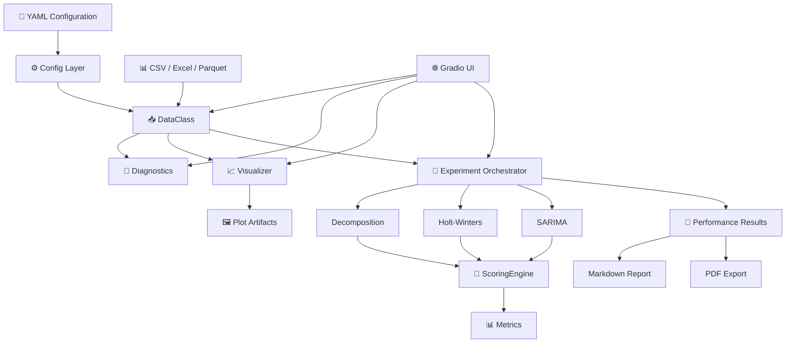
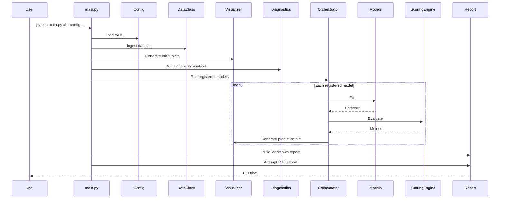
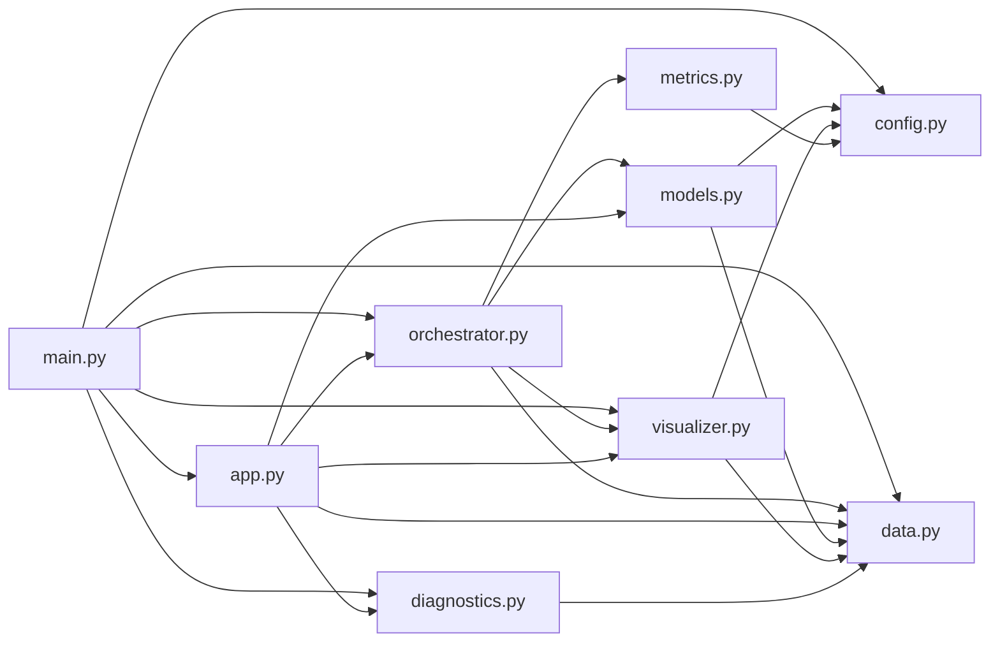

# 📈 Time Series Lab

> **A practical, configuration-driven time-series forecasting and analytics laboratory — from raw data ingestion to diagnostics, forecasting, evaluation, visualization, and report generation.**

<!-- DEMO PLACEHOLDER
Replace this block with a real GIF/video/demo once one is available.

Example:
<p align="center">
  
</p>

<p align="center">
  <a href="YOUR_DEMO_URL">🚀 Live Demo</a>
  ·
  <a href="YOUR_VIDEO_URL">🎥 Demo Video</a>
</p>
-->
---

https://github.com/user-attachments/assets/b675196c-3e17-4d0c-8025-321c75a34a27

---

<p align="center">
  
  
  
  
  
</p>

<p align="center">
  <strong>🧠 Forecast</strong>
  &nbsp;·&nbsp;
  <strong>🔬 Diagnose</strong>
  &nbsp;·&nbsp;
  <strong>📊 Evaluate</strong>
  &nbsp;·&nbsp;
  <strong>📈 Visualize</strong>
  &nbsp;·&nbsp;
  <strong>📝 Report</strong>
</p>

---

## ✨ Why This Project?

Time-series experimentation often becomes a collection of disconnected notebooks, scripts, plots, and manually maintained environments.

**Time Series Lab** brings those concerns into one Python project:

```text
📂 Dataset
   │
   ▼
📥 Data ingestion & train/test split
   │
   ├───────────────┐
   ▼               ▼
🔬 Diagnostics    📊 Visual analysis
   │               │
   └───────┬───────┘
           ▼
      🤖 Forecasting
      ├─ Decomposition
      ├─ Holt-Winters
      └─ SARIMA
           │
           ▼
      📏 Evaluation
      ├─ MAE
      ├─ MSE
      ├─ RMSE
      └─ MAPE
           │
           ▼
     📈 Predictions
           │
           ▼
      📝 Reports
      ├─ Markdown
      └─ PDF*
```

> [!IMPORTANT]
> `*` PDF export depends on the installed rendering stack and may be skipped gracefully by the application if PDF rendering fails.

---

## 🧭 Table of Contents

- [✨ Why This Project?](#-why-this-project)
- [🚀 What It Can Do](#-what-it-can-do)
- [🏗️ Architecture](#️-architecture)
- [📦 Project Structure](#-project-structure)
- [💻 Requirements](#-requirements)
- [⚡ Installation](#-installation)
  - [Windows](#windows)
  - [macOS](#macos)
  - [Linux](#linux)
  - [Verify the Installation](#verify-the-installation)
- [🧪 Run the Tests](#-run-the-tests)
- [▶️ Run the Application](#️-run-the-application)
  - [Headless CLI Pipeline](#1-headless-cli-pipeline)
  - [Interactive Gradio UI](#2-interactive-gradio-ui)
- [⚙️ Configuration](#️-configuration)
- [📊 Input Data](#-input-data)
- [🤖 Forecasting Models](#-forecasting-models)
- [🔬 Diagnostics](#-diagnostics)
- [📏 Evaluation Metrics](#-evaluation-metrics)
- [📈 Visualizations & Outputs](#-visualizations--outputs)
- [📓 Notebooks](#-notebooks)
- [🧩 Codebase Map](#-codebase-map)
- [🛠️ Development Workflow](#️-development-workflow)
- [🔎 Troubleshooting](#-troubleshooting)
- [🤝 Contributing](#-contributing)
- [📜 License](#-license)

---

## 🚀 What It Can Do

| Capability | What it provides |
|---|---|
| 📥 **Data ingestion** | Loads CSV, Excel, and Parquet datasets through the data layer. |
| ✂️ **Train/test splitting** | Uses a configurable row boundary to create training and evaluation sets. |
| 📅 **Time-aware indexing** | Supports an optional datetime/index column. |
| 📈 **Visualization** | Generates line, envelope, seasonal, decomposition, prediction, and related diagnostic plots. |
| 🔬 **Stationarity analysis** | Combines ADF and KPSS tests into a single diagnostic result. |
| 🤖 **Forecasting** | Provides classical decomposition, Holt-Winters exponential smoothing, and SARIMA model implementations. |
| 📏 **Scoring** | Supports MAE, MSE, RMSE, and MAPE with alignment and missing-value validation. |
| 🧪 **Automated tests** | Includes pytest-based data and visualization tests. |
| 🖥️ **Interactive UI** | Provides a Gradio-based interface for dataset exploration and experimentation. |
| 🧾 **Reporting** | Produces Markdown performance reports and attempts PDF export. |
| ⚙️ **Configuration-driven execution** | Centralizes pipeline behavior in YAML configuration. |

---

## 🏗️ Architecture

The project is organized around a small set of focused layers rather than putting the entire experiment inside a single script.



### 🔄 Batch pipeline

`main.py` coordinates the headless workflow:



---

## 📦 Project Structure

```text
TIME_SERIES_LAB/
├── configs/
│   ├── example.yaml          # Example pipeline configuration
│   └── logging.yaml          # Logging configuration
│
├── notebooks/
│   ├── data_preprocessing.ipynb
│   └── dev.ipynb
│
├── src/
│   ├── __init__.py
│   ├── app.py                # Gradio UI + report helpers
│   ├── config.py             # Configuration dataclasses/YAML loading
│   ├── data.py               # Data ingestion and train/test splitting
│   ├── diagnostics.py        # ADF, KPSS and decomposition diagnostics
│   ├── logger.py             # Logging setup
│   ├── metrics.py            # Forecast evaluation metrics
│   ├── models.py             # Forecasting model implementations
│   ├── orchestrator.py       # Model registry and experiment execution
│   └── visualizer.py         # Plot generation
│
├── tests/
│   ├── test_data.py
│   └── test_visualization.py
│
├── main.py                   # Application entry point
├── pyproject.toml            # Project metadata and dependencies
├── LICENSE
└── README.md
```

---

## 💻 Requirements

The project declares:

- 🐍 **Python 3.12 or newer**
- 📦 **uv** for project/environment management
- 🌐 Internet access during the initial dependency installation
- 🗂️ A supported dataset when running the configured pipeline

### Why `uv`?

This repository uses `uv` instead of asking contributors to manually manage `pip`, virtual environments, and dependency installation.

The project declares its dependencies in `pyproject.toml`; `uv` can create/manage the project environment and install those declared dependencies.

> [!TIP]
> You do **not** need to manually create a traditional `venv` before using the project workflow described below.

---

# ⚡ Installation

Choose your operating system and follow **only that section**.

> [!NOTE]
> The commands below are intentionally platform-specific. Do not copy a Windows PowerShell command into Bash, or a Bash activation command into PowerShell.

## Windows

### 1. Install Git

Install Git for Windows from:

- https://git-scm.com/download/win

Verify:

```powershell
git --version
```

### 2. Install `uv`

Open **PowerShell** and run:

```powershell
powershell -ExecutionPolicy ByPass -c "irm https://astral.sh/uv/install.ps1 | iex"
```

Close and reopen PowerShell after installation, then verify:

```powershell
uv --version
```

### 3. Clone the repository


```powershell
git clone https://github.com/Ibraheem-Al-hafith/TIME_SERIES_LAB.git
cd TIME_SERIES_LAB
```

### 4. Install the project environment and dependencies

```powershell
uv sync
```

### 5. Verify Python

```powershell
uv run python --version
```

You should have Python `3.12+`.

---

## macOS

### 1. Install Git

First verify whether Git is available:

```bash
git --version
```

If Git is not installed, macOS may offer to install the Xcode Command Line Tools.

Alternatively, install Git from:

- https://git-scm.com/download/mac

### 2. Install `uv`

Open Terminal and run:

```bash
curl -LsSf https://astral.sh/uv/install.sh | sh
```

Restart your terminal, then verify:

```bash
uv --version
```

### 3. Clone the repository

```bash
git clone https://github.com/Ibraheem-Al-hafith/TIME_SERIES_LAB.git
cd TIME_SERIES_LAB
```

### 4. Install the project environment and dependencies

```bash
uv sync
```

### 5. Verify Python

```bash
uv run python --version
```

You should have Python `3.12+`.

---

## Linux

### 1. Install Git

On Debian/Ubuntu-based systems:

```bash
sudo apt update
sudo apt install -y git
```

Verify:

```bash
git --version
```

For other Linux distributions, install Git using your distribution's package manager.

### 2. Install `uv`

Open a terminal and run:

```bash
curl -LsSf https://astral.sh/uv/install.sh | sh
```

Restart your terminal, then verify:

```bash
uv --version
```

If `curl` is unavailable, the official `uv` documentation also provides alternative installation methods.

### 3. Clone the repository

```bash
git clone https://github.com/Ibraheem-Al-hafith/TIME_SERIES_LAB.git
cd TIME_SERIES_LAB
```

### 4. Install the project environment and dependencies

```bash
uv sync
```

### 5. Verify Python

```bash
uv run python --version
```

You should have Python `3.12+`.

---

## Verify the Installation

From inside `TIME_SERIES_LAB`, run:

```bash
uv run python -c "import pandas, numpy, scipy, statsmodels; print('Core dependencies loaded successfully.')"
```

Then:

```bash
uv run pytest
```

A successful test run confirms that the environment and the repository's automated tests can execute.

---

## 🧪 Run the Tests

The project uses `pytest`.

Run the complete test suite:

```bash
uv run pytest
```

Run with more verbose output:

```bash
uv run pytest -v
```

Run a specific test module:

```bash
uv run pytest tests/test_data.py
```

or:

```bash
uv run pytest tests/test_visualization.py
```

### Test configuration

`pyproject.toml` configures pytest with:

```toml
[tool.pytest.ini_options]
minversion = "7.0"
addopts = "-ra -q"
testpaths = ["tests"]
pythonpath = ["."]
```

This makes the repository root available on the Python path and tells pytest where the tests live.

---

# ▶️ Run the Application

The main entry point is:

```text
main.py
```

The application exposes two execution modes:

```text
main.py
├── cli    → headless batch pipeline
└── ui     → interactive Gradio interface
```


## 1. Headless CLI Pipeline

### Step 1 — Prepare your configuration

Start from:

```text
configs/example.yaml
```

Copy it to your own configuration file:

```text
configs/config.yaml
```

Then edit the dataset settings:

```yaml
data:
  path: "data/raw/monthly_sales.csv"
  split_size: 120
  index_col: "Date"
  target: "Sales"
```

Update these values to match your real dataset.

### Step 2 — Run the pipeline

```bash
uv run python main.py cli --config configs/config.yaml
```

The pipeline performs the following high-level operations:

1. 📥 Loads the configured dataset.
2. ✂️ Creates train/test splits.
3. 📈 Generates initial visualizations.
4. 🔬 Runs stationarity diagnostics.
5. 🤖 Runs the registered forecasting models.
6. 📏 Calculates configured evaluation metrics.
7. 📊 Generates prediction visualizations.
8. 📝 Writes a Markdown performance report.
9. 📄 Attempts PDF report generation.

### Expected output locations

The exact plot filenames depend on the selected target and visualization methods, but the configured output directories include:

```text
plots/
reports/
```

The batch pipeline writes:

```text
reports/performance_report.md
reports/performance_report.pdf
```

The PDF is attempted conditionally and may not be produced if PDF rendering fails.

---

## 2. Interactive Gradio UI

Launch the interactive web interface with:

```bash
uv run python main.py ui
```

The application is configured to listen on:

```text
http://127.0.0.1:7860
```

> [!NOTE]
> The source configures Gradio with `server_name="0.0.0.0"` and `server_port=7860`. Open `http://127.0.0.1:7860` in your local browser.

The UI provides interactive workflows around:

- 📥 Dataset upload
- 🎯 Target/index selection
- 📈 Visualization
- 🔬 Decomposition and stationarity diagnostics
- 🤖 Model experimentation
- 📊 Comparative evaluation

---

# ⚙️ Configuration

The primary configuration model is defined in `src/config.py`, while an example YAML configuration is provided in:

```text
configs/example.yaml
```

A simplified configuration looks like:

```yaml
name: "time_series_forecasting_pipeline"

data:
  path: "data/raw/monthly_sales.csv"
  split_size: 120
  index_col: "Date"
  target: "Sales"

visualizer:
  plot_path: "plots"
  decomposition_model: "additive"
  style_theme: "seaborn-v0_8-whitegrid"
  dpi: 150
  acf_lags: 40
  max_time_ticks: 15

models:
  decompose:
    model: "additive"
    period: 12

  exponential_smoothing:
    trend: "add"
    seasonal: "add"
    seasonal_periods: 12

  sarima:
    p: 1
    d: 1
    q: 1
    P: 1
    D: 1
    Q: 1
    s: 12

scoring:
  mae: true
  mse: true
  rmse: true
  mape: true
  epsilon: 0.00001
```

## Configuration sections

| Section | Responsibility |
|---|---|
| `data` | Dataset path, split boundary, index column, target column |
| `visualizer` | Plot output path, style, resolution, seasonal/decomposition visualization settings |
| `models.decompose` | Classical decomposition settings |
| `models.exponential_smoothing` | Holt-Winters settings |
| `models.sarima` | SARIMA orders and seasonal period |
| `scoring` | Metric switches and MAPE zero-protection behavior |

<details>
<summary>🔍 What does <code>split_size</code> mean?</summary>

`split_size` is the row boundary used by the data layer to divide observations into training and test sets.

For example:

```yaml
split_size: 120
```

means the first 120 observations are assigned to training and the remaining observations are assigned to the evaluation/test portion.

</details>

<details>
<summary>🧮 What does <code>epsilon</code> do?</summary>

MAPE divides by the actual target value. True zero values therefore create a mathematical domain problem.

The scoring layer supports an optional `epsilon`:

```yaml
epsilon: 0.00001
```

When configured, zero actual values are replaced by that small floor value for the MAPE calculation.

If `epsilon` is `null` and true zeros exist, MAPE raises a `MathematicalDomainError`.

</details>

---

# 📊 Input Data

The data layer documents support for:

```text
.csv
.xlsx
.parquet
```

A typical time-series dataset may look like:

```csv
Date,Sales,Temperature
2026-01-01,1200,24.2
2026-02-01,1275,25.1
2026-03-01,1310,27.3
2026-04-01,1290,29.0
```

Configure the corresponding columns:

```yaml
data:
  path: "data/raw/monthly_sales.csv"
  index_col: "Date"
  target: "Sales"
  split_size: 120
```

### Important data-layer behavior

The tests verify that the data layer:

- loads supported datasets;
- creates train/test partitions;
- converts a configured datetime index;
- reports a missing index column through logging and falls back to sequential indexing;
- raises `FileNotFoundError` for missing files;
- raises `ValueError` for unsupported extensions.

---

# 🤖 Forecasting Models

The model registry currently exposes three model identifiers:

| Registry key | Model | Core approach |
|---|---|---|
| `decompose` | Classical decomposition | Trend projection + seasonal pattern |
| `exponential_smoothing` | Holt-Winters | Exponential smoothing with trend/seasonality |
| `sarima` | SARIMA | Seasonal autoregressive integrated moving-average model |

The registry is defined in `src/orchestrator.py`:

```python
MODEL_REGISTRY = {
    "decompose": DecompositionModel,
    "exponential_smoothing": ExponentialSmoothingModel,
    "sarima": SARIMAModel,
}
```

### 🧩 Model interface

The forecasting classes share a common abstraction:

```text
BaseModel
├── fit(...)
└── predict(...)

    ├── DecompositionModel
    ├── ExponentialSmoothingModel
    └── SARIMAModel
```

This makes the orchestration layer independent of the concrete forecasting implementation.

---

# 🔬 Diagnostics

The diagnostics layer provides statistical analysis intended to help understand the behavior of a time series before or alongside forecasting.

## Stationarity

The project combines:

- **ADF — Augmented Dickey-Fuller**
- **KPSS — Kwiatkowski-Phillips-Schmidt-Shin**

The combined diagnostic can classify the series into categories such as:

```text
                    ADF stationary?
                    ┌───────┴───────┐
                   YES              NO
                    │                │
              KPSS stationary?  KPSS stationary?
                 /     \            /     \
               YES     NO         YES      NO
                │       │          │        │
             Strict   Difference  Trend    Non-
             Stationary Stationary Stationary Stationary
```

The public diagnostic API includes:

```python
calculate_stationarity(...)
generate_stationarity_report(...)
fit_decomposition(...)
```

---

# 📏 Evaluation Metrics

The scoring layer currently supports:

| Metric | Meaning |
|---|---|
| **MAE** | Mean Absolute Error |
| **MSE** | Mean Squared Error |
| **RMSE** | Root Mean Squared Error |
| **MAPE** | Mean Absolute Percentage Error |

Before scoring, `ScoringEngine` validates:

1. Prediction and actual lengths.
2. Exact index alignment.
3. Missing values.
4. Non-empty sanitized evaluation arrays.

This is important for time-series evaluation because predictions must correspond to the same temporal observations as the ground truth.

---

# 📈 Visualizations & Outputs

The `Visualizer` class is responsible for generating graphical artifacts.

The source currently includes visualization workflows for areas such as:

- 📈 line-series visualization
- 📦 envelope/component analysis
- 🔄 seasonal plots
- 🧩 seasonal decomposition
- 🎯 predictions vs. actuals
- 📐 in-sample fitting
- 📊 diagnostic plots

Generated plots are written to the configured visualization directory.

Example:

```yaml
visualizer:
  plot_path: "plots"
```

---

# 📓 Notebooks

Two notebooks are included for exploratory/development work:

```text
notebooks/
├── data_preprocessing.ipynb
└── dev.ipynb
```

Use notebooks for experimentation and investigation; keep reusable production behavior in `src/`.

---

# 🧩 Codebase Map

| File | Responsibility |
|---|---|
| `main.py` | CLI/UI entry point and batch pipeline |
| `src/app.py` | Gradio presentation layer and report helpers |
| `src/config.py` | Configuration dataclasses and YAML loading |
| `src/data.py` | Dataset loading and train/test management |
| `src/diagnostics.py` | Statistical diagnostics and decomposition analysis |
| `src/logger.py` | Logging configuration |
| `src/metrics.py` | Numerical metrics and scoring engine |
| `src/models.py` | Forecasting model abstractions and implementations |
| `src/orchestrator.py` | Model registry and experiment coordination |
| `src/visualizer.py` | Plot lifecycle and visualization generation |
| `tests/test_data.py` | Data-layer tests |
| `tests/test_visualization.py` | Visualization tests |

### 🧠 Dependency direction



---

# 🛠️ Development Workflow

A simple contributor workflow is:

```text
1. Clone
   ↓
2. Install with uv
   ↓
3. Run tests
   ↓
4. Create/update configuration
   ↓
5. Run CLI or UI
   ↓
6. Inspect plots/reports
   ↓
7. Make changes
   ↓
8. Run tests again
```

### Recommended commands

```bash
# Install/synchronize dependencies
uv sync

# Run tests
uv run pytest

# Run the CLI pipeline
uv run python main.py cli --config configs/config.yaml

# Run the interactive UI
uv run python main.py ui
```

### Dependency maintenance

The repository intentionally uses `uv` as its Python project/dependency workflow.

The dependency source of truth currently lives in:

```text
pyproject.toml
```

When dependency management is changed, keep the project metadata and development instructions synchronized.

> [!NOTE]
> A future repository-level `Makefile` can wrap the common setup, test, and run commands to reduce the number of commands new contributors need to remember. It is intentionally not documented as an existing command until that file is actually added.

---

# 🔎 Troubleshooting

<details>
<summary>❌ <code>uv: command not found</code> / <code>uv is not recognized</code></summary>

Restart your terminal after installing `uv`.

Then verify:

```bash
uv --version
```

On Windows PowerShell, close and reopen the PowerShell session.

If the command is still unavailable, consult the official `uv` installation documentation.

</details>

<details>
<summary>❌ Python version is too old</summary>

The project requires Python:

```text
>= 3.12
```

Check:

```bash
uv run python --version
```

`uv` can manage Python installations as part of its workflow, so prefer using the `uv` project commands rather than manually mixing several Python installations.

</details>

<details>
<summary>❌ Configuration file not found</summary>

The CLI requires a valid YAML configuration path.

Use:

```bash
uv run python main.py cli --config configs/config.yaml
```

and confirm that the file exists:

```text
configs/config.yaml
```

</details>

<details>
<summary>❌ Dataset file not found</summary>

Check the path in your YAML:

```yaml
data:
  path: "data/raw/monthly_sales.csv"
```

The path is interpreted relative to the directory from which the application is launched.

</details>

<details>
<summary>❌ MAPE fails because the dataset contains zero values</summary>

Configure an epsilon value:

```yaml
scoring:
  mape: true
  epsilon: 0.00001
```

If you deliberately want zero targets to be treated as an error, leave `epsilon` unset/null.

</details>

<details>
<summary>❌ PDF report is not generated</summary>

The batch pipeline treats PDF generation as an optional/gracefully isolated step.

Check the terminal logs. The Markdown report should still be written to:

```text
reports/performance_report.md
```

</details>

---

# 🤝 Contributing

Contributions should preserve the project's core principles:

- 🧩 Keep responsibilities separated by module.
- 🧪 Add or update tests when behavior changes.
- ⚙️ Keep configuration behavior explicit.
- 📏 Preserve input alignment and validation in metric calculations.
- 📚 Keep documentation synchronized with actual commands and source behavior.
- 🚫 Do not commit credentials, API keys, private datasets, or generated secrets.
- 🔍 Prefer small, reviewable changes.

Before submitting a change:

```bash
uv sync
uv run pytest
```

For larger architectural changes, document the reason and expected impact in the pull request.

---

# 📜 License

This project contains a `LICENSE` file in the repository.

The exact license terms should be read from that file rather than inferred from this README.

---

## 🗺️ Documentation Status

| Area | Status |
|---|---|
| Project overview | ✅ |
| Architecture | ✅ |
| Cross-platform setup | ✅ |
| `uv` workflow | ✅ |
| CLI usage | ✅ |
| Gradio UI usage | ✅ |
| Configuration | ✅ |
| Data format | ✅ |
| Models | ✅ |
| Diagnostics | ✅ |
| Metrics | ✅ |
| Testing | ✅ |
| Project structure | ✅ |
| Troubleshooting | ✅ |
| Demo media | 🟡 Placeholder |
| Live demo | 🟡 Not supplied |
| Screenshots | 🟡 Not supplied |
| Repository URL | 🟡 Not supplied |
| Makefile | 🟡 Planned separately |

---

## ⭐ If This Project Helps You

If this repository becomes public and useful to you, consider:

- ⭐ starring the repository;
- 🐛 opening an issue when you find a reproducible problem;
- 💡 proposing improvements;
- 🤝 contributing tests, documentation, or implementation improvements.

<p align="center">
  <strong>📈 Turn time-series data into something you can inspect, test, forecast, and explain.</strong>
</p>
